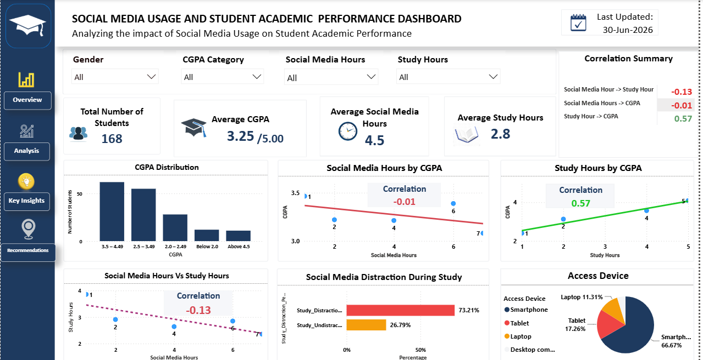
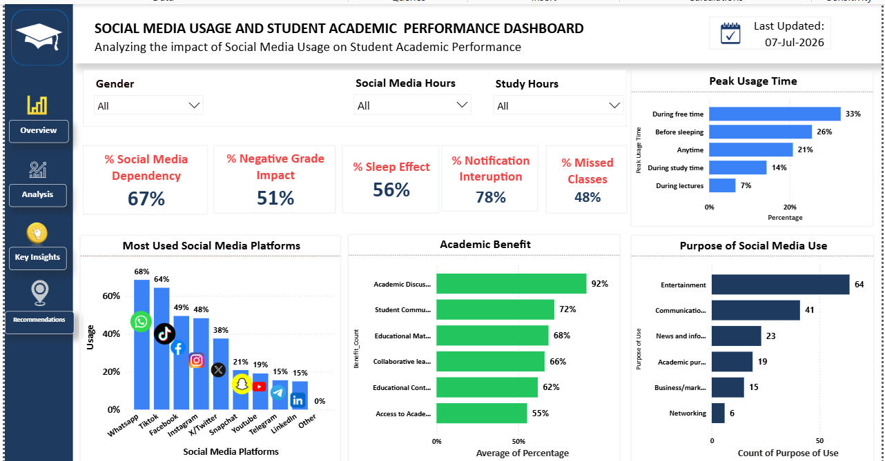

# Analyzing the impact of Social Media Usage on Student Academic Performance using Data Visualization Technique

# Project Overview

This project analyzes the relationship between students' social media usage and their academic performance using Power BI. The dashboard provides interactive visualizations that reveal usage patterns, study habits, and how social media influences academic outcomes.

# Objectives
- Analyze students' social media usage patterns.
- Identify the most frequently used social media platforms.
- Measure the relationship between social media usage and academic performance.
- Examine how study hours compare with social media usage.
- Provide actionable insights through interactive dashboards.
  Dataset

The dataset consists of responses collected through a structured questionnaire completed by university students.

# Variables include:

- Gender
- Age
- Level of Study
- Daily Social Media Hours
- Study Hours
- CGPA
- Most Used Platform
- Purpose of Use
- Peak Usage Time
- Notification Distraction
- Sleep Impact
- Academic Benefits
- Collaborative Learning
- Academic Information Access
- Social Media Dependency
- Tools Used
- Power BI
- Power Query
- DAX
- Microsoft Excel
- Dashboard Features

# The dashboard includes:

- Total Students
- Average Study Hours
- Average Social Media Hours
- Average CGPA
- Most Used Platforms
- Purpose of Social Media Usage
- Social Media Hours vs CGPA
- Social Media Hours vs Study Hours
- Gender Distribution
- Peak Usage Time
- Notification Distraction Analysis
- Sleep Impact Analysis
- Academic Benefit Analysis
- Collaborative Learning Analysis
- Academic Information Access

# Interactive slicers allow filtering by:

- Gender
- CGPA
- Study Hours
- Social Media Hours

# Data Cleaning & transformation
- Removed duplicate responses.
- Checked for missing values.
- Standardized text values.
- Converted Yes/No responses to binary values (1 and 0) where required.
- Converted Likert Scale responses into numerical values for analysis.
- Created calculated measures using DAX.
- Created KPI measures for dashboard visualization.

# Key Insights

- Social Media Usage Hours has a negative relationship with academic performance: The analysis shows a negative correlation (-0.01) between social media usage hours and CGPA. This shows that increased social media usage is associated with decline in academic performance, although the relationship is relatively weak.
- Study Hours significantly improves academic performance: The analysis shows a positive correlation (+0.57) between study hours and CGPA. This indicates that students who dedicate more time to studying generally achieve higher CGPA. This is one of the strongest relationships observed in the dataset, making study hours one of the strongest predictors of academic success.
- Social Media Hours has a negative correlation (-0.13) with study hours: This indicates that increased time spent on social media appears to reduce the time available for studying, which may indirectly affect academic performance.
- Smartphones are the primary access device: The analysis shows that 66.67% of the students use Smartphones to access social media platforms. Mobile devices have increased social media accessibility, thereby increasing the likelihood of frequent usage and potential academic distractions.
- Students primarily use social media for Entertainment (64), followed by communication (41). This indicates that students use social media for recreational purposes, rather than educational, which may reduce academic focus.
- Whatsapp (68%), Tiktok (64%) and Facebook(49%)  are the most popular platforms: This indicates that students are more focused on communication and short-form content social media platforms, which can increase daily screen time and distract from academic activities.
- Social Media causes significant study disruption: The analysis shows 73.21% of students being distracted during study as a result of Social Media usage while only 26.79% recorded no distraction.. This is a major challenge to maintaining concentration and effective study habits.
- Notifications are a major source of distractions: Approximately 78% of students reported experiencing notification interruption. Frequent notifications disrupt attention and reduce students' ability to focus on academic tasks. 
- Social Media influences sleep pattern: The analysis shows 56% of students reported sleep-related effects from social media usage. Excessive social media use, especially at night, may contribute to poor sleep quality, which can negatively affect learning and academic performance. 
- Social Media dependency is high among students: About 67% of students reported signs of social media dependency. A large proportion of students rely heavily on social media, increasing the risk of distraction, procrastination, and reduced academic productivity. 
- Class attendance is affected by social media usage: 48% of students reported missing classes due to social media related activities. Excessive engagement with social media may negatively impact attendance and participation in academic activities. 
- Social Media provides academic benefits: Despite the challenges, students identified several educational benefits: Academic Discussions (92%), Student Communities (72%), Educational Materials (68%), Collaborative Learning (66%). Social media can support learning when used purposefully, particularly for academic discussions, collaboration, and access to educational resources.

# Recommendations
- The findings reveal that while social media offers valuable educational opportunities, excessive usage contributes to reduced study time, frequent distractions, sleep disruption, and lower academic performance. Study hours emerged as the strongest positive factor influencing CGPA. Students who maintain a balance between social media engagement and academic responsibilities tend to achieve better educational outcomes. Students should thereby;
- Limit recreational social media usage and maintain a balanced schedule.
- Turn off notifications during study periods to improve concentration.
- Increase study hours through structured time management practices.
- Utilize social media for academic discussions and collaborative learning.
- Promote digital wellness awareness and responsible online behavior.
- Reduce nighttime social media usage to improve sleep quality.
- Encourage consistent class attendance and academic engagement.
- Monitor personal screen time and develop healthy digital habits.
- Social media is a powerful tool that can either support or hinder academic success. Students who use social media purposefully for learning while limiting excessive recreational use are more likely to achieve better academic outcomes.

# Repository Contents
- Power BI Dashboard (.pbix)
- Dataset
- Dashboard Images
- Project Report
- Documentation
- Dashboard Preview

Author

Mercy Daramola

Junior Data Analyst

LinkedIn: https://www.linkedin.com/in/mercyy-daramola

GitHub:https://github.com/MercyDaramola
